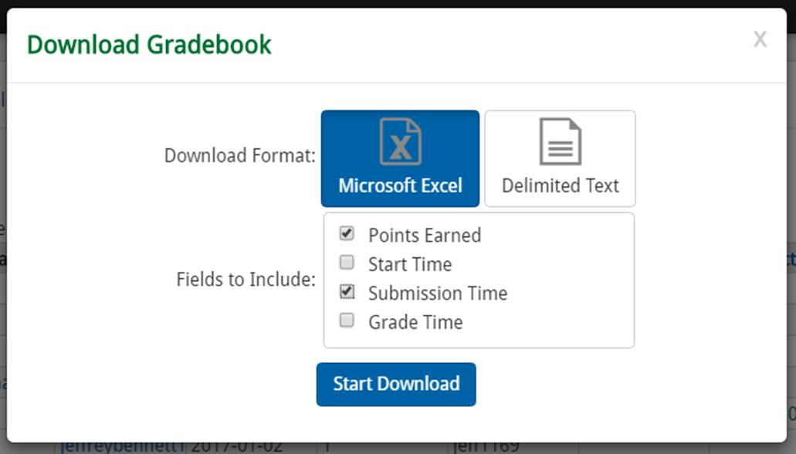

# Grade transfer

Excel file with Visual Basic to transfer grades from Excel Educator to Learning Suite

Grade import instructions from a few years ago...

---

Basically, you need to download the current scores from Learning Suite (I do this in case TAs change scores in LS) and from MyEducator. You paste the scores into the attached “Grade Import” file, and then run some macros. The macros are simple and transfer set columns that are hard-coded in VBA. If you don’t have the same gradebook setups as I do, you may need to adjust the columns. _View constants in code to change them if needed_.The macros will generate a CSV file with the updated scores in it that you then upload to Learning Suite.

## Due Dates

Before starting, adjust the due dates on the _Due Dates_ sheet to match this semester's due dates. You only need to do this once.

## Learning Suite

In Learning Suite, download late days, assignments, and exams from LS. Include student last and first name. _The introduction assignment doesn't appear on this screenshot, but is in the import file, so select it also, or adjust hard-coded columns in the code_:

Copy columns A-Q of this file into columns A-Q on the “Learning Suite” sheet in the grade-import file.

## MyEducator

Download gradebook from MyEducator. Include points earned and submission time:

Paste all the data in this file to the _MyEducator_ sheet, starting in cell A1.

## Grade import file

In the **Grade Import** tab, click each button in order (make sure you do this while on the _Learning Suite_ sheet). The buttons are:

- **Extract MyEducator** pulls the relevant columns from the _MyEducator_ sheet into the main _Learning Suite_ sheet.

- **Match IDs** matches the LS entries to the ME entries using LS NetID and ME Student ID as the primary key.

  - Students with an LS account but not an associated ME account are moved to the _LS Errors_ sheet.
  - Students with an ME account, but not an associated LS account (they either do not have the correct Student ID in ME, or they dropped the course after purchasing ME) will be moved to the _ME Errors_ sheet.
  - I usually have my TAs email students who appear on **both** the _LS Errors_ and the _ME Errors_ sheets a few times to warn them that they need to have a correct Student ID in ME.

  Sometimes the match IDs sub is laggy. ¯\\_(ツ)_/¯

- **Transfer Scores** transfers scores to LS (if a higher score is recorded in LS, the ME score is not transferred). The procedure references the due dates that are hard-coded in the _Due Dates_ sheet. This procedure also docks points for late assignments and removes penalties in exchange for late days (if enough exist). The cells are color-coded also. Here are the color descriptions from the code comments:

  - green - full score

  - purple - full score, but redeemed late day

  - red - late penalty, no late day redemption

  - orange - second submission higher than Learning Suite current score

  - yellow - cheater, 0 on Learning Suite DO NOT TRANSFER SCORE

  - yellow in ME data Date field - late submit

  - pink - score was manually entered after late day without a late penalty

  - blue in late Day field in LS data - late day deduction occurred

    I color-coded when I was writing and debugging, but then decided to keep the coloring as it’s helpful to have a feel for what’s transferring. I tried to heavily comment the code if you want to look at it. Also, if a score is set to “0” in LS, the scores are not transferred from ME. I use the “0” score to flag cheaters.

- **Prepare Export** moves all rows that have been changed in the _Learning Suite_ sheet (indicated by having a color change) to a text file with a timestamped file name. This file can then be uploaded to Learning Suite.

I’d suggest looking through the code. It’s in a Module called “MatchIDs.” It’s fairly straightforward. I really don’t like VBA and it’s very laggy, but it seems to work. I choose VBA so my TAs could run the program, but I ended up running it myself. It makes transferring scores for 1100 students a snap. (This is the first and only time I’ve programmed in VBA, so I am not a VBA expert, I just know how to program.)

Oh, and I wrote this code assuming you have students who’ve completed assignments. I think you will get a runtime error if you try to transfer scores with no assignments completed. I never bothered to fix it. (I really don’t like VBA, if I haven’t mentioned that.)

Finally, I don't keep track of submission attempts. This means there's the rare case of a student submitting a late assignment twice before Thursday (the range of the 4 late days) and getting double docked late days. I get around this by not transferring scores between Mondays and Thursdays when there may be late submissions or, if I want to transfer grades between Monday and Thursday, I remove the color background on late submissions so they don't transfer during this time period.
